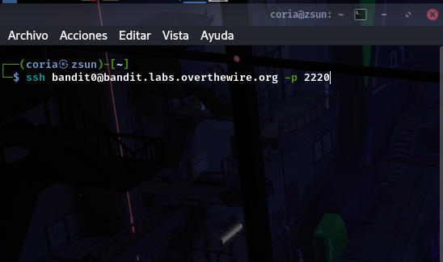

## Natas
###  • Nivel 0  → Nivel 1  
>user: natas0  
password: natas0  
ssh: http://natas0.natas.labs.overthewire.org -p 2220  

###  • Nivel  → Nivel
###  • Nivel  → Nivel
###  • Nivel  → Nivel
###  • Nivel  → Nivel
*entrando al servidor:*  

[//]: # ( > user: natas  
password: -  
ssh: http://natas0.natas.labs.overthewire.org -p 2220  
)
 `02/04 | 1.0`